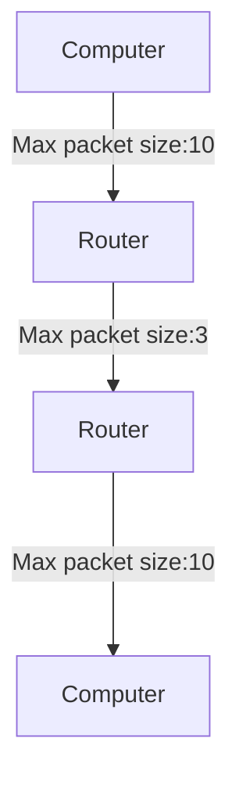

(Links:: [[Computer Networks]] -> [[Lecture 8 Network Layer Part 2|Lecture 8]])
- Data link layer uses switches to connect computers
- Switches use a hash table to look up the address -> not built for a large network

> [!question] Network layer answers some questions:
> 1. How to get from **A** to **B**?
> 2. How to connect multiple networks?
> 3. How to manage network resources?

- Layers below don't know of end-to-end delivery (only concerned with transporting inside one network)
- Layers above don't know the network graph and how things are connected
- Router operates on the network layer
- Routers perform *store-and-forward* packet switching

> [!question] Why does a router have the data link and phisical layer twice?
> Router can connect to a wireless access point (Wifi) and Ethernet (physical)
> Router uses a different data link protocol to communicate with ISP
# Routing
- Properties of routing:
	- Correctness
	- Simplicity
	- Robustness
	- Stability
	- Fairness
	- Efficiency
- collection of all best paths to a given destination forms a (spanning) tree
- routing tables store on which link the packet must be sent

> [!example] Routing table for C
> 
> | To  | Distance | Line |
> | --- | -------- | ---- |
> | A   | 7        | A    |
> | B   | 59       | A    |
> | C   | 0        | -    |
> | D   | 75       | E    |
> | E   | 1        | E    |

## Distance vector routing
- Send your *distance vector* to your neighbors
- Update you *routing table* based on incoming *distance vectors*

> [!danger] Bad News Propagation
> ```mermaid
> graph LR;
> A -- "4->2000" --- B
> B -- 1000 --- C
> C -- 1 --- A
> ```
> - Distance vector A:
> 	- A, -
> 	- B, 4 -> B, 6 (via C)
> 	- C, 1
> - Distance vector B:
> 	- A, 4
> 	- B, -
> 	- C, 5
> - Distance vector C:
> 	- A, 1
> 	- B, 5 -> B, 7 (via new A)
> 	- C, -
> - A looks at C and updates B to 6 which causes C to update B -> loop until it exceeds 1000

> [!danger] Count to infinity problem
> ```mermaid
> graph LR;
> B --x A
> D --- B
> D --- C
> ```
> - Distance vector B:
> 	- A, 1 -> A, **999** -> A, **3**
> 	- B, -
> 	- C, 2
> 	- D, 1
> - Distance vector D:
> 	- A, 2    (B thinks it can reach A via D, and updates)
> 	- b, 1
> 	- C, 1
> 	- D, -
> - Distance vector C:
> 	- A, 3
> 	- B, 2
> 	- C, -
> 	- D, 1
> - When the connection from B to A breaks, B looks at D and updates its vector table to 2+1=3
> - D sees that all neighbors have a path of A>2 -> it updates it's value to 4
> - the loop continues
## Link state routing
- Doesn't suffer from *count to infinity problem*
- uses *[[Shortest path]] algorithm*
- routers flood network with packets and build overview of the network and run shortest path algorithm
## Hierarchical routing
- Group machines on network layer together to simplify routing tables

> [!example]
> ```mermaid
> graph LR;
> subgraph A
> A1 --- A2
> A1 --- A3
> end
> subgraph B
> A2 --- B1
> A3 --- B2
> B1 --- B2
> B2 --- B3
> end
> subgraph C
> C1 --- C2
> end
> C1 --- B1
> C1 --- B2
> C2 --- B2
> ```
> - Routing table of A1 reduced from 7 to 4 (A2,A3,B,C)

# Internetworking
- Challenges for sending packets over multiple networks:
	- Different protocols
	- Different maximum packet sizes
	- Different costs (for ISP)
	- Different quality of services
## Structure of the Internet
- ISPs and (large) corporations are **Autonomous Systems**
- Large corporation can use multiple points of attachment: *multihoming*
- Homes and small businesses connect to the Internet via ISPs
- Peering points (Internet eXchange Points: **IXP**s) connect ISPs and backbones
## Open Shortest Path First (OSPF)
- Routing within an autonomous System (*Intradomain* routing)
- uses a form of link state routing and builds a graph representation of the network
- uses hierarchical routing by dividing the network into different areas for large networks
	- routers inside an area have a RT of other areas and the routers inside the area
	- area border routers contain address for machines in all the areas connected to it 
- for destinations not in area, go through the backbone (more simple)
- Boundary routers connect to another AS -> Uses both an Interior and Exterior Gateway Protocol
## Border Gateway Protocol (BGP)
- Routing between independent networks (*Interdomain* routing)
- policies for routers put in place by ISPs, companies or countries
- Autonomous system advertise which IP addresses are accessible through it's network to other autonomous systems
- uses distance vector routing and path vectors (to see if the path goes through the same router) to mitigate count to infinity problem
## Tunneling
- two connecting networks can use different protocols
- messages are "wrapped" in the protocol of the second network (used to route IPv6 packets over IPv4 networks)
## Packet fragmentation
- packet size can be limited by hardware, software, protocols etc.

- packets are split/fragmented into smaller packets and sent to destination (non-transparent fragmentation)
	- packets can be reassembled by router at other side (transparent fragmentation)
- Maximum Transmission Unit (MTU) discovery
	- request sent to source to use smaller packets

---
(Links:: [[Computer Networks]] -> [[Lecture 8 Network Layer Part 2|Lecture 8]])
References: