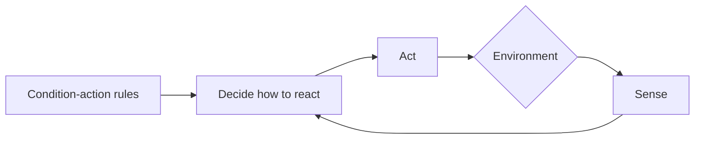
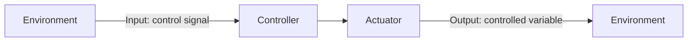

# Autonomy and Controllers
- Autonomy is the ability to make one's decisions and act on them. Autonomy can be total or partial
- Controllers provide hardware and software that makes the system autonomous, by using sensor inputs and any other information to decide what to do
# Control
## Deliberative control
- Example: Navigation Systems
	- **Positioning**: locating the vehicle
	- **Routing**: determining a good route from a source to a destination
	- **Guidance**: providing visual and audio feedback on the route
- The route planning module
	- Plans the optimal route from $A$ to $B$ 
	- Usually the shortest route is considered the best, but it can also be the fastest and less congested, with minimal nr. of transfers, etc.
- **Deliberative control**: Think hard, act later
	- Deliberative systems were the first to be tried in early AI (Chess)
	- **Planning** is the process of looking ahead at the outcomes of the possible actions and searching for the sequence of actions that will reach the desired goal
	- **Searching** is the inherent part of planning 
	- Uses a map
- Map
	- An internal representation of the world
	- Can be stored in many ways
	- In navigation systems, the maps are digital and represented as a valued *graph* consisting of *nodes (vertices)* and *edges* with a *cost number* attached
- The [[Shortest path]]
	- A **path** is a sequence of adjacent nodes between a node $v_i$ and a node $v_j$
	- The **total cost** of the path is the sum of the cost number of all the edges
	- The **shortest path** is a path with the minimal total cost
	- Greedy Best First Search
		- Uses an estimate of how far from the goal any vertex is. It searches only towards the goal
		- $A^*$ algorithm combines the [[Dijkstra algorithm]] with the Greedy Best-First-Search algorithm
## Reactive control
- **Principle**: Don't think, react!
- No internal representation of the environment
- Need rules that couple specific actions to specific sensed situations
- A Simple Reactive Agent:

- Open-loop Control

- The controller for the anemometer (pseudocode)
```python
while loop:
	read the wind speed
	
	if speed = low then
		switch green LED on
	if speed = medium then
		switch orange LED on
	if speed = high then
		switch red LED on
Endloop
  ```
- **Calibration**
	- Measures exactly what means dark and what means daylight
	- Needed before any program can be written
	- We need to use a sensor called luxmeter
- Controller for curtains (pseudocode)
```python
Set initial curtain state to close
Loop:
    Measure light level
    if (level>10)
	    then open
    if (level<1)
	    then close
Endloop
  ```
- Passive opto-sensor
	- Measures ambient light: input
	- Generates a voltage that depends on the amount of light: output
- Active opto-sensor
	- Transmitter LED shines light on object
	- Receiver Photo-Diode measures reflected light
- Feedback close-loop control
  ```mermaid
  flowchart LR
    A[Goal: Desired value] --> B[Comparator]
    B --> C[Controller] --> D[Actuator] --> E[Sensor] --> B
    D --> F[Output: Controlled variable]
  ```
- **Obstacle Handling**
	- Avoid
	- Find & retrieve
	- Track
	- Solutions
		- Simple: You know where it is because you bumped in it
		- Better: You know that it is in the neighbourhood = proximity
		- Best: You know where it is and how far from you = ranging. If you get close you can grab it or avoid it
- Ultrasound
	- Also called *sonars* from *so*nd *na*vigation and *r*anging
	- Refer to a range of sound frequencies that are beyond human hearing
	- Don't need contact, detect objects from a distance
- Sonar Evaluation
	- Cheap but not accurate (10-50cm)
	- Problem with sound **specular reflection**. If the beam hits a smooth surface at a shallow angle it is reflected outwards and not back to the emitter
- LIDAR
	- *LI*ght *D*etection *A*nd *R*anging
	- Uses a laser that is swept across the sensor's field of view
	- Use light pulses instead of sound. Don't have the problem with specular reflection
	- More accurate (mm range), much faster, but more expensive
	- They see only a narrow slice of the world and have a relatively short range. The beams also can't detect colors and may bounce off shiny surfaces, so it's hard to spot certain hazards (such as a body of water)
 - Controller algorithm for a line follower
```python
position the robot on the black line
while (true)
  while (both sensors detect white)
    drive straight forward
  end_while
  if (left sensor sees black) then turn left
  if (right sensor sees black) then turn right
end_while
```
- Algorithm for wall follower
```python
position the robot  
while (true)  
	if distance-to-the-wall is the desired one
	    then keep driving  
	if distance-to-the-wall is larger than desired
		then turn towards the wall
	else turn away from the wall
end_while
```

---
References: