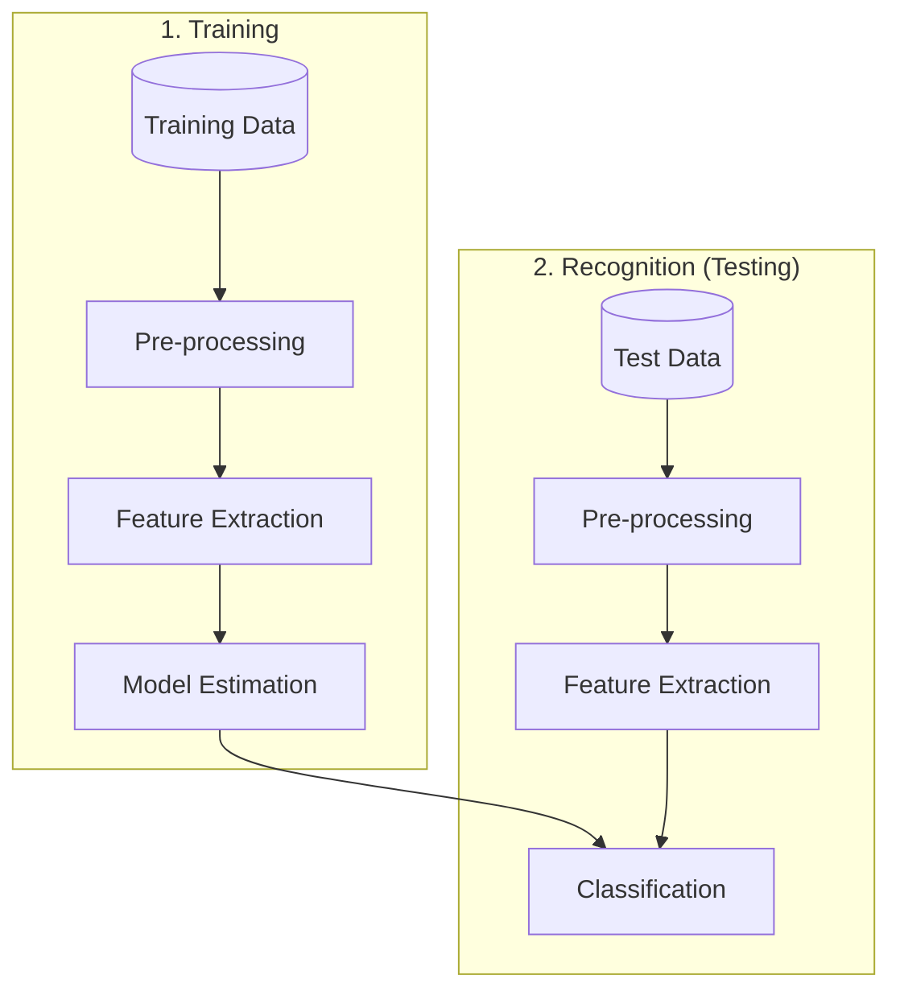

# Pattern recognition
A pattern is the opposite of a chaos; It is an entity vaguely defined, that could be given a name. Recognition is the identification of a pattern as a member of a category we already know, or we are familiar with.
**Classification**: 
- Given a few *classes*.
- Objects are described by *features*
- The system needs a *training set* with positive and negative examples
- If a new item comes, its features are measured and the system (called classifier) has to decide which of these classes this newcomer belongs to.
- Each item belongs to precisely one class and the set of classes covers all possible output space

Steps in building a pattern recognition system:
1. Define the classes
2. Choose and extract the features
	- Features have to have discriminative power
	- Enough to **reliably separate** the classes
3. Train the classifier
4. Evaluate the performance of the classification
Classification algorithms are rule based, such as: `If(colour == Copper) and (diameter == 20.50mm) then class = 10c`
# Feature extraction and simple classification
## Image recognition
Shapes can be described through features such as, the perimeter, form factor, roundness ratio, area and the Euler number. The Euler number is the total number of objects minus the holes in those objects.
The form factor is the relation between the area and the perimeter (circles have a form factor of 1): $$f=\frac{4\pi A}{P^{2}}$$
Preprocessing methods explained in [[Percom 4 Image Processing]] can be used such as:
- Binarization: Usually presented with a grayscale image, binarization is then simply a matter of choosing a threshold value.
- Morphological Operators: Remove isolated specks and holes
- Segmentation: Check connectivity of shapes, label, and isolate

Shape properties can be extracted by using the function `regionprops`
```matlab
stats = regionprops(lables,'area','centroid');
stats.Area       % returns areas to each of the labels
stats.Centroid   % returns center coordinates to each of the labels
```
### Optical Character recognition
Statistical moments:
- Total mass: number of pixels
- Centroid: Center of mass
- Elliptical parameters
	- Eccentricity: Ration of major to minor axis
	- Orientation: Angle of major axis
- Skewness
- Kurtosis
## Sound recognition
Speech recognition is the process of converting an acoustic signal, captured by microphone or a telephone, to a set of words. Usually the first two formants (broad peaks/maximum of the spectrum) can distinguish a vowel.

| Vowel | Formant $f_1$ | Formant $f_2$ |
| ----- | ------------- | ------------- |
| u     | 320 Hz        | 800 Hz        |
| o     | 500 Hz        | 10000 Hz      |
| ɑ     | 700 Hz        | 1150 Hz       |
| a     | 1000 Hz       | 1400 Hz       |

**Mel Frequency**: Humans are better at recognizing changes in pitch at lower frequencies $$m=2595\log_{10}\left(1+\frac{f}{700}\right)$$

---
References: