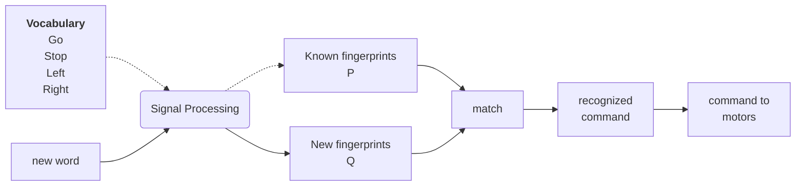
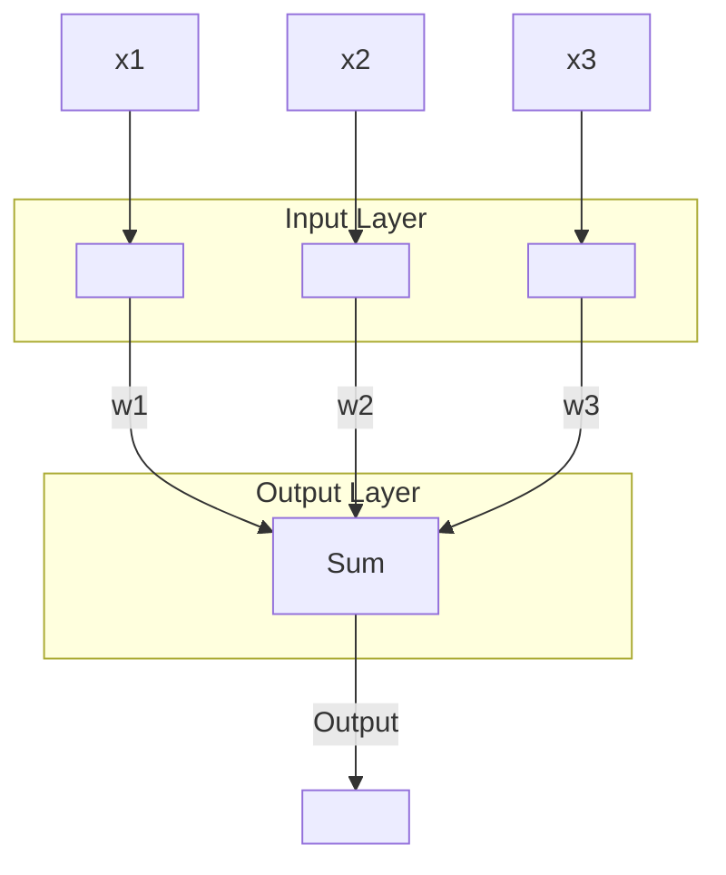
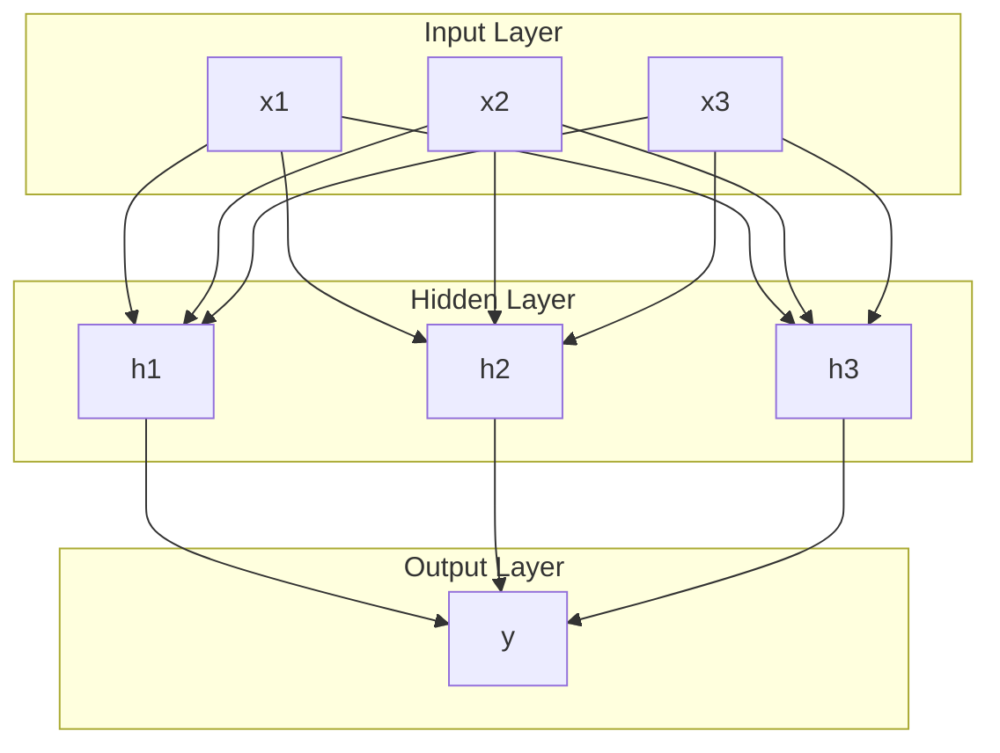

# Template matching
**Rule-based classifier evaluation**: This works well if we don't have too many features. If we have many features, we have to use better classifiers.
Template matching takes a set of reference patterns and decides to which one an unknown *test pattern* matches best. It uses the nearest-neighbour principle that measures the **similarity** or the **distance** between the two patterns.
**Maximum Correlation approach**: The distance is the 2D correlation coefficient between the images. If the images are identical the correlation is 1. Otherwise it is less than 1.

To build an ASR (Automatic Speech Recognition) we need for each signal a **fingerprint** that can be compared. We first speak a word into the microphone, calculate and store the fingerprint and do this for all words we would like. These templates can now be used for speech recognition.
## Recognition by minimum distance approach
We first speak in a word and calculate the fingerprint. This is compared to known fingerprints by calculating the **Euclidian distance**

– -> : training
---> : recognition
## Template matching evaluation
It's a classification algorithm from the **supervised learning** category which needs a set of examples and training. It's simple, but it's training data must have the same parameters (size, illumination,...). It's downside is that it's slow.
# Neural Networks
## Artificial neural networks
They are a collection of **artificial neurons**, that learn mappings (through algorithms) between input and output. 
### Artificial neuron
- Some inputs are more important than others -> Synapses are replaced with **weights** $w_1,w_2...w_m$
- The output y is binary and depends on a comparison between the weighted sum of the inputs and a threshold θ. $$y=\sum\limits_{j=0}^{p}x_{j}w_{j}$$
  If k>θ, then the neuron is “**ON**”, output is 1 
  Otherwise the neuron is “**OFF**”, output is 0
- A **set of weighted inputs** -> dendrites + synapses
- An **adder -> soma**
- An **activation function** that decides when the neuron fires 
- Output is binary
- ![[Artificial neuron.png|500]]
- An artificial neuron as classifier
	- Output is 0 or 1. It means that a neuron **can classify** between two classes
	- But one neuron *cannot learn*! The weights and threshold have fixed values
 ## Perceptron
 - A structure that contains a neuron with adjustable weights. *It can learn*!

## Learning to classify
- Done by **training**
- Training set contains examples of input (features) and correct output (class)
- For each example the perceptron adjusts the coefficients until the output is equal to the desired output
## A neural network
- A NN is more complex than a perceptron because it has **hidden** layers between the input and output layers
- The hidden layer is called so, not because we can't see it, but because it has no direct connection to the outside world, like the input and output layers.
- Also called multi-layer perceptron or **Deep Neural Network**

## Classification with NN
- First **initialize** the weights with some random numbers
- **Learn/Train** the network by adjusting the weights until correct (desired) output will be obtained for each input from the training set. The algorithm is called **back-propagation**
- **Test**: Once the network is trained, feed a new input and ask the network to decide
- The output vector will say to which class the input does belong
# Summary
- There are many ways to classify signals
- We discussed template matching and neural networks

---
References: