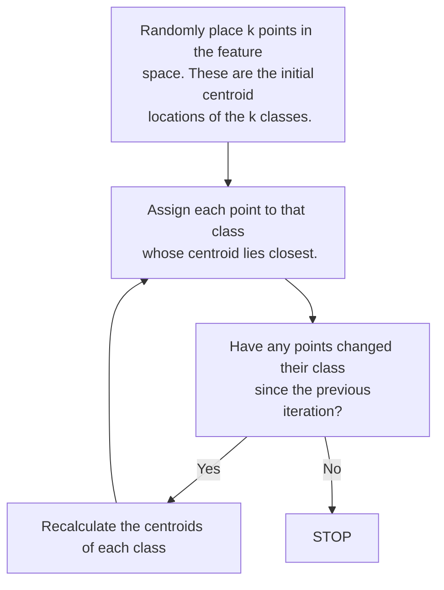

(Links:: [[Pervasive Computing]])
# Probabilistic Classifiers
## Probability basics
**Uncertainty is everywhere**:
- Sensors are often subject to errors. The stored data is only an older, approximated version of the entity being monitored.
- We can only say :"*the probability* that the car is situated at 4m from the access point *is 0.9*", "the room temperature is in the interval 10° - 20° with the probability of 0.7".
- This is probabilistic language

Probabilistic learning:
- Probability models view learning as a process of reducing uncertainty.
- Used a lot in modern pattern recognition.

Discrete Random Variables:
- A is a Boolean-valued *random* variable if A denotes an event, and there is some degree of uncertainty as to whether A occurs

Probability $P(A)$
- We write $P(A)$ as "the fraction of possible worlds in which $A$ is true"
- $P(A)$ is an *unconditional probability*
- $P(A|B)$ ([[Conditional probability]]) is the probability that $A$ is true given that $B$ is all we know 
- [[Bayes' Theorem|Bayes rule]]: $$P(B|A)=\frac{P(A|B)\times P(B)}{P(A)}$$
	- The essence of the Bayesian approach is to provide a mathematical rule explaining how should our existing beliefs $P(B)$ change in the light of new evidence $A$.
## Naïve Bayes classifier
- Given a set of classes: $C_1, C_2, ...C_i,..C_n$ with prior probabilities $P(C_1), P(C_2), ...$
- Use Bayes rule to calculate the posterior probabilities that an object with the features vector $X$ belongs to class $C_i, P(C_i|X), i=1..n$
- The class with the highest posterior probability is the most likely class.

For this to work, all elements in the feature vector must be independent. If we have 2 classes $w_1$ and $w_2$ and the features $x$, then with Bayes rule we would have the following **classification rule**: 
If $P(w_{1}|x) > P(w_{2}|x)$ then $x$ is classified to $w_1$.
If $P(w_{2}|x) > P(w_{1}|x)$ then $x$ is classified to $w_2$.

> [!example] We must, given a situation with the features *Day, Season, Wind and Rain*, predict if the train is either *On time, Late or Cancelled*. 
> $P(\text{event} = \text{on time})$ is the *prior* probability
> $P(\text{event} = \text{on time}|\text{season = winter})$ is the *posterior* or [[Conditional probability]] that the train is on time given that it is winter.
> We then calculate from the training set 3 posterior probabilities (for each of the classes) using the Bayes rule.
> 
> $P(\text{event} = \text{on time}|...)=P(\text{event} = \text{ontime})\times P(\text{Saturday}|\text{ontime})\times P(\text{winter}|\text{ontime})\times ...$
> $P(\text{event} = \text{late}|...)=P(\text{event} = \text{late})\times P(\text{Saturday}|\text{late})\times P(\text{winter}|\text{late})\times ...$
> $P(\text{event} = \text{cancelled}|...)=P(\text{event} = \text{cancelled})\times P(\text{Saturday}|\text{cancelled})\times P(\text{winter}|\text{cancelled})\times ...$
> 
> The highest $P$ in this case is the most probable class. This approach can work well, but features are often not independent, so this wouldn't work.
## Hidden Markov Models
HMM is a probabilistic reasoning algorithm that works on a set of temporal data. With each clock tick the system moves to a new state. Theses states are hidden and we only see some **observations**.
You train a HMM by first calculating the probability $P(x)$ that a person is in a state $x$. We then calculate the transition probability $P(x_j|x_i)$ and the observation probability $P(y_i|x_i)$. The HMM can now be used as a classifier. Given an observation vector $y$ we calculate $P(x_i|y)$. The class with the highest probability $P$ wins.

HMM are Hidden Markov models. These are graphical probabilistic reasoning algorithms that can be used for example for classification. They are dynamic models because the states are evolving in time. They contain hidden states and observable states connected with edges. Each transition from one state into another has a certain probability. The challenge is to infer the hidden states knowing the visible observable states. For example we mount sensors in a house (door, bed, floor, toilet) in order to monitor its inhabitants daily activity(cooking, sleeping, washing, toileting, etc). A HMM will connect the visible states z given by the sensor readings and the hidden states x (cooking, sleeping, washing, toileting, etc). The transition probabilities p(zt|zt-1), p(zt|xt) are established by long days of training, annotation, log books, etc. The hidden states given by the probability that you are in state x knowing the observable z, p(x|z) are inferred by using Bayes theory.
# Unsupervised learning
- Do not have any training sets
- They explore data and search for naturally occurred patterns and clusters within it.
- Once the clusters have been found we can make decisions
## K-means Clustering
It tries to partition data in $k$ clusters. Two inputs are **close to each other** in this feature space if their vectors are similar, meaning that the distance between these two vectors is small. If two points are close, they are **similar** and **cluster**.
![[Example for 2 classes.png|500]]

# Reinforcement learning
Between supervised and unsupervised learning lies reinforcement learning. Here the environment gives rewards or punishments but does not say what the right answer is.
Procedure: 
- Observation of the environment
- Deciding how to act using some strategy
- Acting accordingly
- Receiving a reward or penalty
- Learning from the experiences and refining the strategy
- Iterate until an optimal strategy is found
# Classifiers evaluation
The classifiers performance mostly depends on the **predictive accuracy** (how much of the unseen data is correctly classified). Most often the data is divided into a training set (70%) and a test set (30%).
The accuracy is based off of the **error rate**: $$\text{Error rate} = \frac{\text{Number of classification errors}}{\text{Number of classification attempts}}$$
$$\text{Accuracy} = 1 - \text{Error rate}$$
Evaluation falls under either of 4 classes: 
- **True** positive (TP): An instance of class $A$ is correctly classified as class $A$ (true)
- **True** negatives (TN): An instances not from class $A$ is correctly rejected as not being in $A$
- **False** positives (FP): An instance that is not from $A$ is wrongly classified as in $A$
- **False** negatives (FN): An instance that is from $A$ was wrongly rejected as not from $A$ -> **Danger**
## Confusion Matrix
A confusion matrix shows how often each class was correctly/falsely classified. Each entry describes the count.

|                 | Pedestrians | Non-pedestrians | Total Instances |
| --------------- | ----------- | --------------- | --------------- |
| Pedestrians     | TP 800      | FN 100          | P 900           |
| Non-pedestrians | FP 5        | TN 95           | N 100           |

From the confusion matrix you can calculate different statistics about the classification model:
$$\text{Accuracy } a=\frac{TP+TN}{n}$$
$$\text{Precision } p = \frac{TP}{TP+FP}$$
$$\text{Recall (True postive rate) } r = \frac{TP}{TP+FN}$$
$$\text{False positive rate} = \frac{FP}{FP+TN}$$
## Receiver operation graph (ROC)
ROC graphs depict the tradeoff between hit rates and false alarm rates over noisy channels.
![[ROC.png|500]]
True positive rate: $tpr$
False positive rate: $fpr$

---
References: