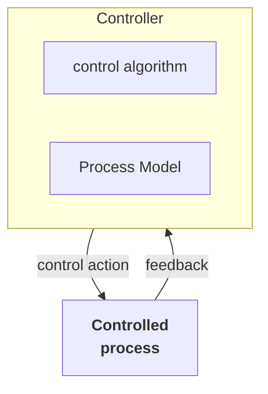

(Links:: [[Pervasive Computing]])
# Concept of operation
A system is a combination of interacting elements organized to achieve one or more stated purposes.

![[Systems engineering diagram.canvas]]

> [!example] Insulin Pump
> # Stakeholders
> - Anyone with an interest in or an effect on, the outcome of the product
> - System's intended users
> - The people who commission the construction of the system, called *clients*
> - Sponsors
> - All responsible technical people
> - Managers
> - Regulators, society and environment

## Concept of operations 
- Product mission statement = a concise description of what it is supposed to do
- System overview
- Operational Scenarios
## Product mission statement
- A product mission statement should be short, descriptive, inspiring and not too detailed

> [!example]- The starship enterprise from the original star trek
> To explore strange new worlds, to seek out new life and new civilizations, to boldly go where no man has gone before.
# Hazard analysis
- **Safety** is freedom accidents or losses - more realistically: an acceptable level or risk while preserving the benefits
- **Accident**: an undesired event that results in a loss (ex. insulin pump user dies)
- **Hazard** is a condition with the potential for causing or contributing to an accident (ex. insulin overdose)
- **Causal scenario**: How can a hazard happen? 
  Overdose because the sensor that measures the blood sugar level has failed
## Risk management
- Required by all safety regulatory standards
- Step 1: Identify hazards
- Step 2: Estimate risk for each hazard
  Hazard risk = hazard **probability** $\times$ hazard *severity*
- Step 3: Eliminate all hazards, or more realistically, their risks have to be reduced to an acceptable level by changing the design or issuing safety-related requirements
## Hazard Identification 
### Fault tree analysis
- Top-down method to identify safety weaknesses in a system using a failure mindset
- Starts with the top undesired event
- Ask: **Which combination of basic events can lead to a specific hazard?** until basic causes are identified
- A logical diagram called a **fault tree** is constructed showing the logical event relationships
- ![[Insulin Pump FTA.canvas]]
### Failure Mode and Effect Analysis
Bottom up technique where we first ask **what will happen if this component fails?**
Example: Car

| Item | Identification | Description                                                          | Failure Modes          | Effects                        | Safeguards                                 | Actions          |
| ---- | -------------- | -------------------------------------------------------------------- | ---------------------- | ------------------------------ | ------------------------------------------ | ---------------- |
| 1    | Car Tire       | - Supports Weight<br> - Traction<br> - Conrnering <br> - Smooth Ride | Flat                   | - Stranded<br> - Loose Control | - Spare Tire <br> - In Trunk               | Acceptable as is |
| 2    | Gas Tank       | Holds fuel                                                           | - Empty <br> - Blow up | - Stall <br> - Car Destroyed   | - Fuel Gage <br> - Locate away from Engine | Acceptable as is |
### System Theory Accident Model and Processes
This hazard analysis method models the system with controllers and controlled processes. The control structure looks as follows:


> [!example]- Insulin Pump
> ```mermaid
> flowchart TD
> 	a1["Insulin Pump (Controller)"] --Inject Insulin--> b1
> 	b1["Blood Glucose (Controlled Process)"] --Measured BGC--> a1
> ```
### System Theoretic Process Analysis
This process is used to find causal scenarios. These scenarios are a result of a combination of several causal factors that may lead to unsafe control actions and potential loss.
Usually system have more control actions than in the previous example (inject insulin). Each of these control actions could lead to a failure.
The first step is to define the purpose of analysis and identify the STAMP.
This is then used in step 2 to identify unsafe control actions by taking a look at 4 hazardous action types:
- Action required but not provided
- Unsafe action provided
- Incorrect Timing/Order
- Stopped too soon/ Applied too long

The last step includes generating safety requirements to prevent unsafe control actions and therefore mitigate accident causal scenarios.
# Requirements specification
A requirement is an expression of desired behaviour. Requirements specification deals with the who, what and why but *not* how! A requirement engineer must understand, capture and write the user requirements for the product. This results in the **system requirements specification** which the user can then give to the developers, designers and testers. The requirement engineer creates the specification being aware that:
- we understand the application domain
- the customer doesn't always know what they want
- we never make assumptions of what the users want
- customers can change their minds
- users have a high expectation
## Properties of good System requirements specification
- **Correct** – any requirement listed is one that needs to be met.
- **Unambiguous** – an SRS is unambiguous if each specification can have only one interpretation.
- **Complete** – SRS contains all requirements and all req are completely specified.
- **Consistent** – not in conflict with other req.
- **Verifiable** (Testable) – a SRS is verifiable if satisfaction of each req can be established using measurement. Does each req have a fit criterion?
- **Traceable** - focuses on the interrelationship between requirements and their sources, stakeholders, tests, standards, regulations, etc.
## Types of Requirement
Requirements can be categorized into two different types: **Functional** and **Nonfunctional**. 
Functional requirements describe a system's perceived external functionality from the point of view of the user/stakeholder.
Nonfunctional requirements are conditions that a system has to satisfy that go beyond the functionality of the system. Some examples are: 
- Feel and look
- Usability
- Performance
- Safety
- Reliability
- Availability
- Ethical behaviour
## UML diagrams
**Use case diagrams** show how each actor of a system interacts with it (in which case). **Use case specifications** are simple tables that have the following:
- Name
- Short description
- Pre-condition: Prerequisites for successful execution
- Post-condition: System state after successful execution
- System state in case of error
- Actors
- Trigger: events that initiate the use case
- Standard scenario: individual steps to be taken
- Alternative scenario: Deviation from the standard scenario

For each state of the system a use case specification has to be modelled. 

Another popular method is the **State transition diagram**. They are ideal to describe reactive event-driven behaviour. It can show the sequence of **states** an object can be in, events that cause a **transition** to another state, and the **actions** taken when reaching a new state.
The last method is the **activity diagram**. They are useful to *visualize* the *workflow of a use case*. These models are appropriate when the behaviour change occurs mainly **due to the end of an action** executed, and not the occurrence of events, as in the case with state models.

> [!question] Possible exam question
> Imagine you have to build an automatic insulin pump, a wearable device that keeps the blood glucose concentration BGC of a diabetes patient in a healthy range of 4-5.5 mmol/L. Insulin is injected any time the BCG is higher than this range. A BCG lower than this range can be fatal for the patient. The system stores in a log file all the insulin quantities that have been injected.
> 1. Enumerate six stakeholders in this project
> 2. Formulate one functional requirement and one non-functional requirement for this system.
> 3. Identify one accident and for that accident identify one hazard, its possible causal scenario and specify a way to prevent the hazard from happening.
> 4. Generate a set of test cases using Boundary Value Analysis to test the functionality of the system.
> 5. Identify one ethical question relevant to this system.


---
References: