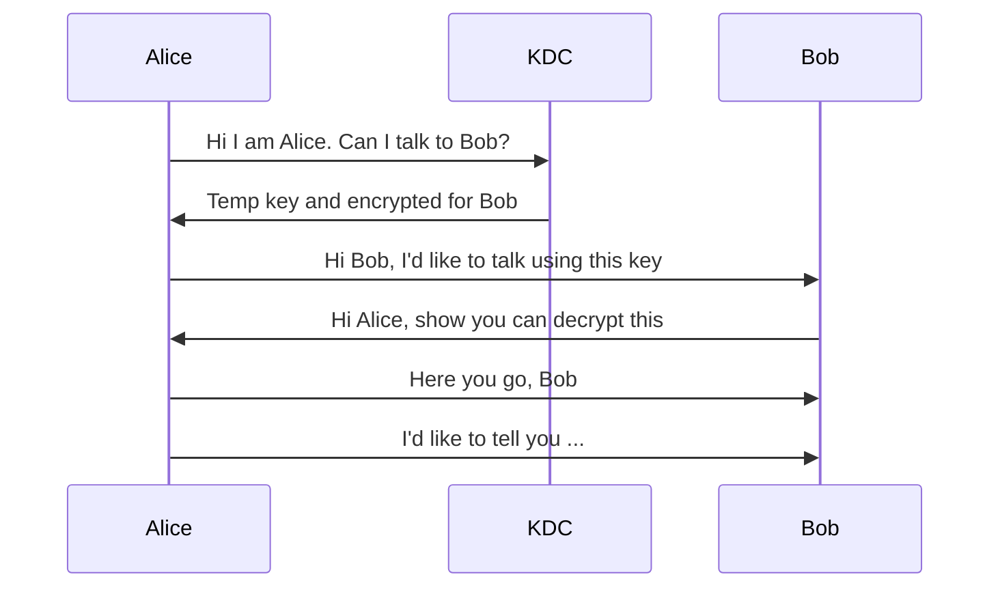

# Introduction
Cryptography allows two people to communicate securely without anyone intercepting or modifying the messages. Cryptography tries to prevail confidentiality, integrity, authentication and non-repudiation (denying something you sent).
## Terminology
- **Plaintext**: The readable text to be transmitted
- **Cipher text**: The unreadable text actually sent
- **Encryption**: Converting plaintext into cipher text
- **Decryption**: Recovering plaintext from cipher text

To minimize that the encrypted data is compromised, we separate the algorithm from the key. This is known as **Kerckhoffs's Principle**. We always assume that the attacker knows the algorithm since we want to reuse the algorithm. The opposite of this would be [[Security by Obscurity]]. This would also mean that if the if there were an attack, it wouldn't be because the algorithm was kept secret, but because the algorithm was faulty. The algorithm can then be examined further.
If an attacker manages to get hold of the plaintext and the cipher text, then for an $n$-bit key, there are at most $2^n$ keys to try.
Third parties can eavesdrop on your traffic at practically every [[Computer Networks|stage over the network]]. So that two people can communicate securely we need to use **end-to-end encryption**. To make sure that data has not been tampered with, we use **digital signatures**, which is linked to the message and the sender. If the message changes, then the signature is invalid, and only the sender has the key to sign.
To prevent anyone from denying that they signed something, we must use **asymmetric digital signatures** where we can verify the signature without needing the signing key.
# Building Blocks
## Cryptographic [[Hashes]]
Hash functions map a message to a hash. These hash algorithms are designed so that the original message is really hard to find out (**hard to reverse**). This also makes it really hard to **create another message** with the same hash.

Cryptographic algorithms require unpredictable numbers for key generation. It is common knowledge however that computers cannot create truly random numbers since CPU's are deterministic. Instead we must use cryptographically secure pseudo-random number generators (PRNG). The pseudo-random number is created from a seed such as the date and time.
# Symmetric Cryptography
Symmetric Cryptography uses a **single key** to encrypt plaintext and decrypt cipher text. It protects confidentiality and with symmetric signatures it provides integrity and authentication.
A type of cipher called the block cipher divides the data into blocks and maps each plaintext block to a cipher block. This is commonly known as Electronic Codebook (ECB). It however allows an attacker to reorder blocks and in most cases reveals repetitions, since the same plaintext transforms to the same cipher text.
To prevent this, Cipher Block Chaining (CBC) is used. Each previous block is linked to the next one.
![[Pasted image 20231007193353.png]]
Not all messages have a size a multiple of the block size, this is where we must use **padding** to add extra bytes. We do not add extra zero bytes, instead we add bytes containing the padding length. Ex: `6e 20 74 05 05 05 05 05`. 
## AES Example in OpenSSL
```c
#include <openssl/evp.h>

static unsigned char *parsehex(const char *s, size_t len) {
  unsigned char *buf = calloc(len, 1);
  for (int i = 0; s[i]; i++)

    buf[i/2] |= (s[i]%16 + (s[i]>>6)*9) << 4*(1-i%2);
  return buf;

}

int main(int argc, char **argv) {  
	const EVP_CIPHER *type = EVP_aes_128_cbc();  
	EVP_CIPHER_CTX *ctx = EVP_CIPHER_CTX_new();  
	unsigned char *key = parsehex(argv[1], EVP_CIPHER_key_length(type)); 
	unsigned char *iv = parsehex(argv[2], EVP_CIPHER_iv_length(type));
	int outlen;  
	ssize_t r;  
	EVP_CipherInit(ctx, type, key, iv, ENCRYPT); 
	do {
	    r = read(0, inbuf, sizeof(inbuf));
	    if (r > 0) {
			EVP_CipherUpdate(ctx, outbuf, &outlen, inbuf, r); 
		} else {
		    EVP_CipherFinal(ctx, outbuf, &outlen);
		}
		write(1, outbuf, outlen); 
	} while (r > 0); 
	EVP_CIPHER_CTX_free(ctx);
}
```
## Symmetric Signature
Message authentication code (MAC) provides signatures for messages, by requiring the key for generating a valid MAC and validating it. It provides integrity, authentication but no non-repudiation. Hash MAC combines the key with the message and then applies a hash function. To verify the message, we compute the signature and verify if it is identical to the one received.
# Asymmetric Cryptography
Asymmetric cryptography (also known as public key encryption) requires the use of two keys: one for the sender and one for the receiver. The most popular public key encryption is [[RSA]]. Using RSA can however still lead to insecurity, that's why the plaintext content is usually *padded*.

## RSA de-/encryption in OpenSSL
### Encryption
```c
#include <openssl/pem.h>
#include <openssl/rsa.h>
int main(int argc, char **argv) {
	unsigned char *inbuf, *outbuf; ssize_t inlen, outlen;
	FILE *keyfile = fopen(argv[1], "r");
	RSA *key = PEM_read_RSA_PUBKEY(keyfile, NULL, NULL, NULL);
	fclose(keyfile);
	inbuf = malloc(RSA_size(key));
	inlen = read(0, inbuf, RSA_size(key));
	if (inlen > RSA_size(key) - 42) return 1;
	outbuf = malloc(RSA_size(key));
	outlen = RSA_public_encrypt(inlen, inbuf, outbuf, key,
	RSA_PKCS1_OAEP_PADDING); /* random padding, needs 42 bytes */
	write(1, outbuf, outlen);
	RSA_free(key);
	return 0;
}
```
### Decryption
```c
#include <openssl/pem.h>
#include <openssl/rsa.h>
int main(int argc, char **argv) {
	unsigned char *inbuf, *outbuf; ssize_t inlen, outlen;
	FILE *keyfile = fopen(argv[1], "r");
	RSA *key = PEM_read_RSAPrivateKey(keyfile, NULL, NULL, NULL);
	fclose(keyfile);
	inbuf = malloc(RSA_size(key));
	inlen = read(0, inbuf, RSA_size(key));
	if (inlen != RSA_size(key)) return 1;
	outbuf = malloc(RSA_size(key));
	outlen = RSA_private_decrypt(inlen, inbuf, outbuf, key,
	RSA_PKCS1_OAEP_PADDING); /* random padding, needs 42 bytes */ write(1, outbuf, outlen);
	RSA_free(key);
	return 0;
	} 
```

RSA is not only used for encryption, but can also be used to digitally sign messages:
1. Alice computes $hash(m)$. 
2. She encrypts it with her private key $d$. 
3. Alice sends $m$ and $E_{d}(hash(m))$ to Bob

Bob then has to verify the signature:
1. Bob determines Alice's public key $e$
2. Bob computes $hash(m)$
3. Bob computes $E_{e}(E_{d}(hash(m)))$
4. If the two are equal, signature is correct

## RSA signing in OpenSSL
### Signing
```c
#include <openssl/evp.h>
#include <openssl/pem.h>
#include <openssl/rsa.h>
int main(int argc, char **argv) {
	unsigned char *sig; unsigned siglen;
	EVP_MD_CTX *ctx = EVP_MD_CTX_create();
	EVP_PKEY *evpKey = EVP_PKEY_new();
	FILE *keyfile = fopen(argv[1], "r");
	RSA *key = PEM_read_RSAPrivateKey(keyfile, NULL, NULL, NULL); fclose(keyfile);
> 	/* make EVP key using RSA key (RSA key will be automatically freed) */
	EVP_PKEY_assign_RSA(evpKey, key);
	sig = malloc(EVP_PKEY_size(evpKey)); EVP_SignInit(ctx, EVP_sha1()); EVP_SignUpdate(ctx, argv[2], strlen(argv[2])); EVP_SignFinal(ctx, sig, &siglen, evpKey); write(1, sig, siglen);
	EVP_PKEY_free(evpKey);
	EVP_MD_CTX_free(ctx);
	return 0;
}
```

### Signature verification
```c
#include <openssl/evp.h>
#include <openssl/pem.h>
#include <openssl/rsa.h>
int main(int argc, char **argv) {
	int r; unsigned char *sig; unsigned siglen;
	EVP_MD_CTX *ctx = EVP_MD_CTX_create();
	EVP_PKEY *evpKey = EVP_PKEY_new(); FILE *keyfile = fopen(argv[1], "r"); RSA *key = PEM_read_RSA_PUBKEY(keyfile, NULL, NULL, NULL); fclose(keyfile);
	/* make EVP key using RSA key (RSA key will be automatically freed) */ EVP_PKEY_assign_RSA(evpKey, key);
	sig = malloc(EVP_PKEY_size(evpKey));
	siglen = read(0, sig, EVP_PKEY_size(evpKey));
	EVP_VerifyInit(ctx, EVP_sha1());
	EVP_VerifyUpdate(ctx, argv[2], strlen(argv[2]));
	r = EVP_VerifyFinal(ctx, sig, siglen, evpKey);
	printf("signature is %s\n", (r == 1) ? "good" : "bad"); EVP_PKEY_free(evpKey);
	EVP_MD_CTX_free(ctx);
	return 0;
}
```

# Key Management
Online, messages are encrypted all the time, and as such a lot of public keys would need to be available publicly, without being tampered with. There are two solutions: provide your public key through a separate **trusted channel**, or get a **trusted third party** to authenticate keys.



This method of using a KDC (Key distribution center) has some drawbacks (single point of failure, machines must be in sync, frequent key replacement...). Another method is to have a **certification authority** (trusted party) issue **certificates** to verify people's identity.
These files contain:
- Identity of holder
- Domain name(s) of holder
- Public key of holder
- Expiration date
- Signature from certification authority (CA)

> [!example]- Certificate
> # Issued to
> Common Name (CN): www.ing.nl
> Organization (O): ING BANK N.V.
> Organizational Unit (OU): \<Not Part Of Certificate> 
> Serial Number: `66:D2:AE:68:EE:47:08:76:00:00:00:00:54:CF:9E:1D`
> # Issued By
> Common Name (CN): Entrust Certification Authority - L1M
> Organization (O): Entrust, Inc.
> Organizational Unit (OU): See www.entrust.net/legal-terms
> 
> # Period of Validity
> Begins On: Friday, 29 March, 2019
> Expires On: Friday, 30 April, 2021
> 
> # Fingerprints
> SHA-256 Fingerprint: `47:64:F5:E1:28:49:76:05:09:50:45:AC:D5:70:18:9E:58:1C:54:10:1B:DA:3B:8C:86:A6:A1:FE:F1:C1:AC:36`
> SHA1 Fingerprint: `A0:D8:42:B9:D9:5F:E7:FC:4F:CC:BF:5F:E7:D5:44:94:56:A7:E9:23`

When Bob creates a certificate signing request, the CA will verify Bob's identity and give in return a certificate and sign it with it's private key. Bob can now use the certificate to prove the public key is his.

Anyone eavesdropping on communication can read [[HTTP]]. This is desirable for private information like passwords and online banking. **Secure Sockets Layer** (SSL) ensures cryptographic protection for a network connection on top of [[TCP]]. Any TCP protocol can be modified to run on top of SSL (ex: HTTPS). 

## SSL in OpenSSL
### Client
```c
#include <openssl/err.h>
#include <openssl/ssl.h>
static void talk_to_server(int fd) {
	char buf[1024];
	int len;
	SSL_CTX *ctx = SSL_CTX_new(TLS_client_method()); SSL *ssl = SSL_new(ctx);
	SSL_set_fd(ssl, fd);
	SSL_connect(ssl);
	len = read(0, buf, sizeof(buf));
	SSL_write(ssl, buf, len);
	len = SSL_read(ssl, buf, sizeof(buf));
	write(1, buf, len);
	SSL_free(ssl);
	SSL_CTX_free(ctx);
}
```
### Server
```c
#include <openssl/err.h> #include <openssl/ssl.h> static void connection_echo(
int fd, const char *pathkey, const char *pathcert) {
	char buf[1024]; int len;
	SSL_CTX *ctx = SSL_CTX_new(TLS_server_method());
	SSL *ssl = SSL_new(ctx);
	SSL_use_certificate_file(ssl, pathcert, SSL_FILETYPE_PEM); SSL_use_PrivateKey_file(ssl, pathkey, SSL_FILETYPE_PEM); SSL_set_fd(ssl, fd);
	SSL_accept(ssl);
	for (;;) {
		len = SSL_read(ssl, buf, sizeof(buf)); if (len <= 0) break;
		SSL_write(ssl, buf, len);
	}
	SSL_free(ssl);
	SSL_CTX_free(ctx);
}
```

# Blockchain
BitCoin is a decentralized digital currency. People can transfer money directly to others without involving banks. It is based on the **blockchain**, where each block of transactions contains a **hash of the previous block**.

---
References: